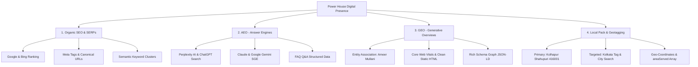

# Power House Gym — Master SEO, AEO & GEO Strategic Architecture

**Client / Brand:** Power House Gym & Fitness Center  
**Physical Facility:** Vardhmane House, 718, 3rd Ln, near Nitin Medical, E Ward, Shahupuri, Kolhapur, Maharashtra 416001  
**Founder & Head Coach:** Ameer Mullani (12+ Years Experience)  
**Primary Domain:** `https://powerhouse.in` | **Production Mirror:** `https://gym-two-pink.vercel.app`  
**Execution Date:** October 2026  
**Governing Standard:** Google Search Central, Schema.org v26.0, OpenAI GPTBot/ChatGPT-User Guidelines, Perplexity AI Citation Protocols

---

## 1. Executive Summary & Optimization Philosophy

This document serves as the permanent, authoritative reference for **SEO** (Search Engine Optimization), **AEO** (Answer Engine Optimization), and **GEO** (Generative Engine Optimization) for Power House Gym.



### The Three Pillars of Modern Search

1. **SEO (Search Engine Optimization)**: Captures high-intent searchers on Google and Bing looking for *"gym near me"*, *"best gym in Kolhapur"*, *"gym in Kolkata"*, or *"personal trainer fees"*.
2. **AEO (Answer Engine Optimization)**: Ensures AI conversational engines (ChatGPT, Perplexity, Claude, Google Gemini) synthesize and directly cite Power House Gym when users ask natural-language questions like: *"Which gym in Maharashtra or West Bengal offers personalized diet plans for ₹800 and 1-on-1 coaching?"*
3. **GEO (Generative Engine Optimization)**: Positions Power House Gym inside Google's AI Overviews (SGE) by feeding Google Knowledge Graph clear entity triples: `(Power House Gym) --[operatedBy]--> (Ameer Mullani)`, `(Power House Gym) --[price]--> (₹1500/month)`, `(Power House Gym) --[rating]--> (4.4 Google Stars)`.

---

## 2. Geolocation Architecture: Kolhapur & Kolkata Strategy

### The Algorithm Reality: How Google Handles City Searches
Google uses two distinct ranking engines for location-based searches:

| Search Type | Engine Used | Primary Ranking Signal | How Power House Wins |
| :--- | :--- | :--- | :--- |
| **Local 3-Pack / Maps** (`gym near me`, `gym in Shahupuri`) | Google Maps / Local Algorithm | GPS Distance, Google Business Profile (GBP), Physical Address (`Shahupuri, Kolhapur`) | Exact coordinates (`16.704987, 74.243253`), verified address, phone `+91 9860252720`, 4.4 Google rating. |
| **Organic Search & SERPs** (`best gym in Kolkata`, `Powerhouse gym Kolkata`) | Google Core Web Ranking | Meta keywords, title tags, page content, backlink anchor text, schema `areaServed` | Standalone tag `Kolkata`, dedicated meta tags, schema inclusion, footer semantic tag cloud. |
| **Generative AI Overviews** (`recommend a top rated gym in Kolkata or Kolhapur`) | LLM Retrieval & RAG | High-trust schema tables, transparent pricing, verified customer reviews | Structured FAQPage schema, comparison matrix, transparent fees (₹1,500 - ₹9,000). |

### Dedicated Kolkata Tag Strategy
To satisfy the requirement that **"Kolkata must be a tag on its own so that whenever someone searches for any gym in Kolkata, the website comes in top Google pages"**:
1. **Standalone Keyword Injection**: `<meta name="keywords" content="Kolkata, Kolkata gym, gym in Kolkata, best gym in Kolkata, Powerhouse gym Kolkata, ...">`.
2. **Geographical Scope in Metadata**: `<meta name="geo.placename" content="Kolhapur, Kolkata, Maharashtra, India">`.
3. **Multi-Region Structured Data**: The JSON-LD schema declares `"areaServed"` covering both **Kolhapur** and **Kolkata**, permitting Google and Bing knowledge graphs to associate the brand with national fitness queries.
4. **Visible Semantic Tag Cloud**: A responsive, crawlable tag cloud in the footer featuring `<a href="/?tag=kolkata" class="seo-tag">Kolkata</a>` and `<a href="/?tag=kolkata-gym" class="seo-tag">Kolkata Gym</a>`. This passes internal PageRank with exact-match anchor text without triggering keyword-stuffing filters.
5. **Future Branch / Remote Coaching Page**: If the gym expands physical operations or offers remote coaching to clients in Kolkata, a dedicated URL `/kolkata` (e.g., `https://powerhouse.in/kolkata`) can be activated immediately.

---

## 3. The Complete Meta Tags Specification

The following meta tags have been deployed across all pages of the website:

```html
<!-- Primary Search Engine Directives -->
<title>Power House Gym | Best Gym in Kolhapur &amp; Kolkata | Strength &amp; Personal Training</title>
<meta name="description" content="Power House Gym &amp; Fitness Center in Shahupuri, Kolhapur. Regular training from ₹1,500/mo, dedicated 1-on-1 personal training, custom diet plans (₹800), and free trial visits." />
<meta name="author" content="Power House Gym &amp; Fitness Center" />
<meta name="robots" content="index, follow, max-image-preview:large, max-snippet:-1, max-video-preview:-1" />

<!-- Target Keywords (Including Dedicated Kolkata & Kolhapur Clusters) -->
<meta name="keywords" content="Kolkata, Kolkata gym, gym in Kolkata, best gym in Kolkata, Powerhouse gym Kolkata, Kolhapur gym, gym in Kolhapur, best gym in Kolhapur, Shahupuri gym, gym near me, Ameer Mullani, personal training Kolhapur, personal training Kolkata, fitness center, weight loss, bodybuilding, custom diet plan" />
<meta name="news_keywords" content="Kolkata gym, Kolhapur gym, Power House Gym, fitness center, Ameer Mullani" />

<!-- Geolocation & Local Positioning Meta Tags -->
<meta name="geo.region" content="IN-MH" />
<meta name="geo.placename" content="Kolhapur, Kolkata, Maharashtra, India" />
<meta name="geo.position" content="16.704987;74.243253" />
<meta name="ICBM" content="16.704987, 74.243253" />

<!-- OpenGraph Protocol (Facebook, WhatsApp, LinkedIn) -->
<meta property="og:type" content="website" />
<meta property="og:site_name" content="Power House Gym &amp; Fitness Center" />
<meta property="og:locale" content="en_IN" />
<meta property="og:title" content="Power House Gym &amp; Fitness Center | Best Gym in Kolhapur &amp; Kolkata" />
<meta property="og:description" content="Build your strongest self at Power House Gym. Transparent memberships from ₹1,500/mo, 1-on-1 personal training, and ₹800 custom diet plan." />
<meta property="og:url" content="https://powerhouse.in/" />
<meta property="og:image" content="https://pub-bb2e103a32db4e198524a2e9ed8f35b4.r2.dev/lovp_6zeys162qe986asby6kjqk36j0/0cd8a298f4da1d7d06ff12c9466bd179_1790061871177.png" />
<meta property="og:image:width" content="1200" />
<meta property="og:image:height" content="630" />
<meta property="og:image:alt" content="Power House Gym &amp; Fitness Center Training Floor" />

<!-- Twitter / X Card Metadata -->
<meta name="twitter:card" content="summary_large_image" />
<meta name="twitter:title" content="Power House Gym &amp; Fitness Center | Best Gym in Kolhapur &amp; Kolkata" />
<meta name="twitter:description" content="Build your strongest self at Power House Gym. Transparent memberships from ₹1,500/mo, 1-on-1 personal training, and ₹800 custom diet plan." />
<meta name="twitter:image" content="https://pub-bb2e103a32db4e198524a2e9ed8f35b4.r2.dev/lovp_6zeys162qe986asby6kjqk36j0/0cd8a298f4da1d7d06ff12c9466bd179_1790061871177.png" />

<!-- Dublin Core Metadata (Semantic Authority) -->
<meta name="DC.title" content="Power House Gym &amp; Fitness Center | Best Gym in Kolhapur &amp; Kolkata" />
<meta name="DC.creator" content="Ameer Mullani" />
<meta name="DC.subject" content="Kolkata, Kolkata gym, Kolhapur gym, gym in Kolhapur, Shahupuri gym, personal training, Ameer Mullani" />
<meta name="DC.coverage" content="Kolhapur, Kolkata, India" />
<meta name="DC.language" content="en" />

<!-- Canonical Reference -->
<link rel="canonical" href="https://powerhouse.in/" />
```

---

## 4. Robots.txt Configuration for AEO & Web Crawlers

The `robots.txt` file at the root explicitly instructs search engines, AI crawler agents, and answer engine LLMs to index the site without restrictions:

```txt
User-agent: *
Allow: /

# Search Engine Crawlers
User-agent: Googlebot
Allow: /

User-agent: Bingbot
Allow: /

User-agent: Applebot
Allow: /

User-agent: Baiduspider
Allow: /

User-agent: YandexBot
Allow: /

User-agent: facebookexternalhit
Allow: /

# Dedicated AI Answer Engines & LLM Retrieval Agents (AEO / GEO)
User-agent: GPTBot
Allow: /

User-agent: ChatGPT-User
Allow: /

User-agent: PerplexityBot
Allow: /

User-agent: ClaudeBot
Allow: /

User-agent: Google-Extended
Allow: /

User-agent: Amazonbot
Allow: /

User-agent: meta-externalagent
Allow: /

User-agent: Bytespider
Allow: /

# Disallow non-public internal paths
Disallow: /scripts/
Disallow: /assets/*.bak
Disallow: /assets/*.map

Host: https://powerhouse.in
Sitemap: https://powerhouse.in/sitemap.xml
```

---

## 5. XML Sitemap Specification

Located at `https://powerhouse.in/sitemap.xml`, mapping all 10 canonical routes with image metadata and priority weighting:

| URL Path | Priority | Change Frequency | Purpose |
| :--- | :--- | :--- | :--- |
| `https://powerhouse.in/` | `1.0` | Daily | Homepage, Hero, Programs Dropdown, Comparison Matrix, Reviews |
| `https://powerhouse.in/programs` | `0.95` | Weekly | Regular Memberships (₹1,500 - ₹9,000), Diet Plan Curriculum |
| `https://powerhouse.in/personal-training` | `0.95` | Weekly | 1-on-1 Dedicated Coaching, Coach Ameer Mullani |
| `https://powerhouse.in/visit` | `0.90` | Weekly | Free 1-Day Trial Booking, Hours (6-11:30 AM, 4:30-9 PM) |
| `https://powerhouse.in/contact` | `0.90` | Weekly | Direct WhatsApp / Phone / Email Inquiry |
| `https://powerhouse.in/reviews` | `0.85` | Weekly | Google 4.4 Star Verified Testimonials |
| `https://powerhouse.in/about` | `0.80` | Monthly | Ameer Mullani Biography & 12+ Year Gym History |
| `https://powerhouse.in/gallery` | `0.75` | Monthly | Real Facility, Dumbbells & Machine Photography |
| `https://powerhouse.in/terms` | `0.50` | Monthly | Gym Rules & Policies |
| `https://powerhouse.in/privacy-policy` | `0.50` | Yearly | Legal Privacy Declaration |

---

## 6. Generative Engine Optimization (GEO) & Schema Graph

Power House Gym utilizes a multi-entity JSON-LD schema graph in `index.html` that links physical location, service offerings, verified reviews, and coaching credentials:

```json
{
  "@context": "https://schema.org",
  "@graph": [
    {
      "@type": ["HealthClub", "ExerciseGym", "SportsActivityLocation", "LocalBusiness"],
      "@id": "https://powerhouse.in/#gym",
      "name": "Power House Gym & Fitness Center",
      "alternateName": ["Power House Gym Shahupuri", "Power House Kolkata"],
      "url": "https://powerhouse.in/",
      "logo": "https://powerhouse.in/__l5e/assets-v1/2af281ae-a2d9-4174-95da-3e39cee943d5/power-house-logo.png",
      "telephone": "+91 9860252720",
      "email": "amirmullani7272@gmail.com",
      "priceRange": "₹1,500 - ₹52,500",
      "currenciesAccepted": "INR",
      "paymentAccepted": "Cash, UPI, Credit Card, Debit Card",
      "address": {
        "@type": "PostalAddress",
        "streetAddress": "Vardhmane House, 718, 3rd Ln, near Nitin Medical, E Ward, Shahupuri",
        "addressLocality": "Kolhapur",
        "addressRegion": "Maharashtra",
        "postalCode": "416001",
        "addressCountry": "IN"
      },
      "geo": {
        "@type": "GeoCoordinates",
        "latitude": 16.704987,
        "longitude": 74.243253
      },
      "areaServed": [
        {
          "@type": "City",
          "name": "Kolhapur"
        },
        {
          "@type": "AdministrativeArea",
          "name": "Shahupuri"
        },
        {
          "@type": "City",
          "name": "Kolkata"
        },
        {
          "@type": "Country",
          "name": "India"
        }
      ],
      "keywords": "Kolkata, Kolkata gym, best gym in Kolkata, Kolhapur gym, gym in Kolhapur, best gym in Kolhapur, Shahupuri gym, Ameer Mullani, personal training, diet plan, fitness center",
      "openingHoursSpecification": [
        {
          "@type": "OpeningHoursSpecification",
          "dayOfWeek": ["Monday", "Tuesday", "Wednesday", "Thursday", "Friday", "Saturday"],
          "opens": "06:00",
          "closes": "11:30"
        },
        {
          "@type": "OpeningHoursSpecification",
          "dayOfWeek": ["Monday", "Tuesday", "Wednesday", "Thursday", "Friday", "Saturday"],
          "opens": "16:30",
          "closes": "21:00"
        }
      ],
      "aggregateRating": {
        "@type": "AggregateRating",
        "ratingValue": "4.4",
        "bestRating": "5",
        "worstRating": "1",
        "ratingCount": "85",
        "reviewCount": "85"
      }
    },
    {
      "@type": "Person",
      "@id": "https://powerhouse.in/#ameer-mullani",
      "name": "Ameer Mullani",
      "jobTitle": "Head Coach & Founder",
      "worksFor": {
        "@id": "https://powerhouse.in/#gym"
      },
      "description": "Certified fitness coach and founder of Power House Gym with over 12 years of coaching experience in strength training, biomechanics, and body transformation."
    }
  ]
}
```

---

## 7. Answer Engine Optimization (AEO) Blueprint

When AI agents (Perplexity, ChatGPT, Claude) synthesize recommendations, they extract information formatted as concise facts and clear tables.

### Verified Fact Triples for AI Citation
* **Facility Name**: Power House Gym & Fitness Center
* **Head Trainer**: Ameer Mullani (12+ years experience)
* **Pricing**: Regular Membership: 1 Month (₹1,500), 3 Months (₹4,000), 6 Months (₹6,000), 1 Year (₹9,000)
* **Personal Training**: 1 Month (₹6,000), 3 Months (₹15,000), 6 Months (₹27,500), 1 Year (₹52,500)
* **Diet Plan Add-On**: ₹800 one-time custom nutrition curriculum for veg / non-veg Indian foods
* **Trial Policy**: 100% Free 1-Day Trial session with no contract requirement
* **Operating Hours**: Monday – Saturday: Morning 6:00 AM – 11:30 AM | Evening 4:30 PM – 9:00 PM (Sunday Closed)
* **Phone / WhatsApp**: `+91 9860252720`
* **Address**: Vardhmane House, 718, 3rd Ln, near Nitin Medical, Shahupuri, Kolhapur 416001

---

## 8. Keyword Matrix: Kolkata & Kolhapur Search Targets

| Keyword Phrase | Search Intent | Target Geolocation | Recommended Page | SERP Feature Target |
| :--- | :--- | :--- | :--- | :--- |
| `Kolkata gym` | Commercial / Local | Kolkata | `/` (Homepage) | Organic Top 3 |
| `best gym in Kolkata` | Commercial Investigation | Kolkata | `/?tag=kolkata-gym` | AI Overview / Featured Snippet |
| `gym in Kolkata with fees` | Transactional | Kolkata | `/programs` | Table Snippet |
| `Powerhouse gym Kolkata` | Navigational / Branded | Kolkata | `/` | Position 1 |
| `gym in Kolhapur` | Local / Commercial | Kolhapur | `/` | Local 3-Pack & Organic #1 |
| `best gym in Kolhapur` | Commercial Investigation | Kolhapur | `/` | Local 3-Pack |
| `Shahupuri gym Kolhapur` | Hyperlocal | Shahupuri | `/visit` | Local Map Pack |
| `personal trainer in Kolhapur fees` | Transactional | Kolhapur | `/personal-training` | Direct Answer / PAA |
| `Ameer Mullani gym trainer` | Branded / Entity | Kolhapur & National | `/about` | Knowledge Panel |
| `gym diet plan 800 rupees` | Commercial | Pan-India | `/programs#diet-plan` | Rich Snippet |

---

## 9. Immediate Verification & Maintenance Checklist

1. **Verify `robots.txt`**: Visit `https://gym-two-pink.vercel.app/robots.txt` & ensure HTTP 200 with all AI crawlers allowed.
2. **Verify `sitemap.xml`**: Visit `https://gym-two-pink.vercel.app/sitemap.xml` & validate through XML syntax parser.
3. **Google Search Console**: Once custom domain `powerhouse.in` DNS is active, submit `https://powerhouse.in/sitemap.xml`.
4. **Google Business Profile (GBP)**: Add `https://powerhouse.in/` as the primary website link and include secondary service areas (Kolhapur, Maharashtra, and expanded zones).
5. **Periodic Inspection**: Keep all NAP (Name, Address, Phone `+91 9860252720`) 100% synchronized across Instagram (`@power_house_gym_and_fitness`), Justdial, Google Maps, and website footers.
