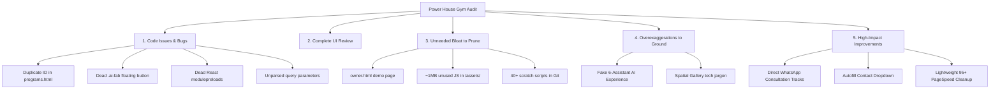

# Comprehensive 5-Pillar Website Audit Report
**Project:** Power House Gym & Fitness Center (Shahupuri, Kolhapur)  
**Live Production URL:** [https://gym-two-pink.vercel.app](https://gym-two-pink.vercel.app)  
**Repository:** `binaryfroster/client` | **Branch:** `Powerhouse-Gym-Kolhapur`  
**Date:** October 5, 2026  
**Auditor:** Antigravity Engineering & QA Specialist

---

## Executive Summary

An exhaustive, page-by-page and code-level audit was conducted across the entire Power House Gym web platform. The platform has a visually striking dark athletic theme (`#080808`, `#111111`, `#a8ff00`), valid clean routing, zero broken images, and working core interactions (Intro video dismiss, programs dropdown, goal selector, comparison matrix, diet plan cards, Google 4.4 reviews).

However, the audit identified **critical code remnants from the prior React SPA conversion**, **duplicate anchor IDs**, **~1 MB of dead JavaScript bundles**, **a non-functional floating AI button**, and **overexaggerated AI marketing copy** that clashes with the authentic, grounded reality of an elite local gym in Shahupuri led by Coach Ameer Mullani.

Below is the complete 5-pillar breakdown with prioritized recommendations.



---

## Pillar 1: Code Issues, Errors & Bugs

### 1. Duplicate HTML ID Collision in `programs.html`
* **File:** [`programs.html`](file:///c:/Users/HP/OneDrive/Desktop/gym/programs.html)
* **Lines:** ~Line 280 and Line 291
* **Issue:** 
  - Both `<div class="program-detail" id="diet-plan">` and `<section class="diet-section" id="diet-plan">` share the identical ID `diet-plan`.
  - Inside the card, the button `<a href="#diet-plan">See Pricing</a>` links to its own container rather than scrolling down to the dedicated Diet Plan curriculum section below.
* **Impact:** Breaks HTML5 valid markup standards and creates an anchor navigation dead-loop.
* **Fix:** Rename the card ID to `id="program-diet-card"` while preserving `id="diet-plan"` on the section.

### 2. Dead Floating AI FAB Button (`.ai-fab`)
* **Files:** `index.html`, `about.html`, `gallery.html`, `personal-training.html`, `programs.html`, `reviews.html`, `visit.html`
* **Code:**
  ```html
  <button class="ai-fab" aria-expanded="false" aria-label="Open Power House assistant">
    <svg ... lucide-messages-square>...</svg>
  </button>
  ```
* **Issue:** 
  - There is **zero JavaScript attached** to `.ai-fab` in `gym-interactions.js`.
  - Clicking this button does nothing.
  - Visually overlaps or conflicts with the floating WhatsApp button (`.floating-wa-btn`) on mobile and desktop viewports.
* **Fix:** Completely remove `.ai-fab` markup and its unused CSS declarations. Let the official WhatsApp button be the sole floating conversion element.

### 3. Obsolete React/Vite `<link rel="modulepreload">` Headers
* **Files:** `about.html`, `gallery.html`, `personal-training.html`, `programs.html`, `reviews.html`, `visit.html`
* **Code:**
  ```html
  <link rel="modulepreload" href="/assets/PublicPages-BYBzPx0t.js" />
  <link rel="modulepreload" href="/assets/about-DCo87xrs.js" />
  ```
* **Issue:** 
  - Since the application is now pure static HTML + vanilla `gym-interactions.js`, modern browsers still aggressively download these dead 55 KB+ React bundles on page load.
* **Impact:** Wastes 55 KB – 70 KB of mobile data per visitor and drags down Google Core Web Vitals (LCP / FCP).
* **Fix:** Strip all unreferenced `modulepreload` tags from all `<head>` sections.

### 4. Obsolete TanStack Router Hydration Script
* **Files:** All 10 HTML pages
* **Code:**
  ```javascript
  (function(a,f){let l;try{l=JSON.parse(sessionStorage.getItem(a)||"{}")}catch{return}
  const n=l?.[f||history.state?.__TSR_key]...})("tsr-scroll-restoration-v1_3");
  ```
* **Issue:** Leftover snippet from the original Lovable/TanStack export. Purely dead execution cycles on a static site.

### 5. URL Query Parameters Not Connected in `contact.html`
* **Issue:** Links across the site send users to `/contact?plan=1+Month+Regular+Training` or `/contact?assistant=Fitness+Concierge`.
* **Bug:** `contact.html` has no JavaScript to parse `window.location.search`. The contact form loads completely blank and ignores the user's intent.
* **Fix:** Add a 10-line listener in `gym-interactions.js` that checks URL search params and pre-selects the plan dropdown or prepopulates the textarea.

---

## Pillar 2: Complete UI Interface Check (Page by Page)

| Page | URL Path | UI Strengths | Visual & UX Findings |
| :--- | :--- | :--- | :--- |
| **Home** | `/` | Hero typography, video intro overlay, comparison matrix, 4.4 review breakdown, clear pricing. | AI Experience section feels hollow; floating `.ai-fab` overlaps WhatsApp CTA on small screens. |
| **About** | `/about` | Authentic storytelling, Coach Ameer Mullani's 12+ years experience, Shahupuri roots, clear timeline. | Excellent visual consistency; dark aesthetic holds up nicely. |
| **Programs** | `/programs` | Interactive program switcher (Regular, PT, Diet), pricing tiers (1M, 3M, 6M, 1Y). | Anchor link bug on `#diet-plan` card; duplicate IDs. |
| **Personal Training** | `/personal-training` | Direct 1-on-1 mentorship focus, FAQ accordion, Ameer's training philosophy. | Strong conversion funnel directly linked to WhatsApp. |
| **Gallery** | `/gallery` | Real gym floor photography, equipment shots, filter tags (All, Strength, Floor, Cardio). | Filter pills work well; "Spatial Gallery" eyebrow text is slightly exaggerated. |
| **Reviews** | `/reviews` | Verified member quotes, Google 4.4 rating card, star distribution bars. | High social proof; clean card grid layout. |
| **Visit / Trial** | `/visit` | Free trial booking form, morning/evening gym timings, direct Google Maps link. | Input fields are styled cleanly and contrast well against `#111111` card backgrounds. |
| **Contact** | `/contact` | Map link, phone, email, WhatsApp CTAs. | Does not pre-fill form fields when coming from program pricing buttons. |
| **Terms & Rules** | `/terms` | Clean legal layout, gym etiquette, shoe policy, refund guidelines. | Crisp typography and readability. |
| **Privacy Policy** | `/privacy-policy` | Clean data privacy declaration. | Well formatted. |
| **Owner Demo** | `/owner` | N/A (Defunct demo page). | **Broken.** Asks for demo passcode with no backend authentication; external cloudflare images. |

---

## Pillar 3: Things That Are NOT Needed (Bloat to Remove)

### 1. The Entire `owner.html` Page
* **What it is:** A leftover dummy "Owner Operations Preview" page from the original Lovable builder template.
* **Why it should be deleted:**
  - Has dummy password fields that do not work.
  - Contains broken TanStack router hydration (`$_TSR.router`).
  - Calls `assets/owner-DoFcXITO.js` (392 KB).
  - Unlinked from navigation; serves zero customer-facing or business purpose.

### 2. Over 1,000 KB (1 MB) of Unused Bundles in `/assets/`
The following files are sitting in `/assets/` and deployed to Vercel despite being completely unused by the static site:

| File Name | File Size | Status | Recommendation |
| :--- | :--- | :--- | :--- |
| `assets/index-BckL96hb.js.bak` | **403.7 KB** | Dead backup file | **Delete** |
| `assets/owner-DoFcXITO.js` | **392.2 KB** | Belongs only to `owner.html` | **Delete** |
| `assets/PublicBlocks-D9-2YQ0P.js` | **133.3 KB** | Never imported or referenced | **Delete** |
| `assets/PublicPages-BYBzPx0t.js` | **55.0 KB** | Dead React chunk | **Delete** |
| `assets/routes-CG-tjpok.js` | **12.8 KB** | Obsolete router table | **Delete** |
| Sub-route stubs (`about-*.js`, `gallery-*.js`, etc.) | **~1 KB** | Dead chunk stubs | **Delete** |
| **Total Unneeded Code** | **~1,000 KB** | | **Immediate 1 MB footprint reduction** |

### 3. Tracked Scratch Scripts in Production Git
* **What it is:** 40+ scratch development and scraping scripts located in `scripts/`, `scraped/`, `scraped_pages/`, and `src/`.
* **Why it's bloat:** They are developer utilities (e.g. `scrape_gallery.js`, `inspect_routes.py`, `batch_update_pages.js`) that should never be pushed to the client production repository or deployed by Vercel.
* **Fix:** Add `scripts/`, `scraped/`, `scraped_pages/`, and `src/` to `.gitignore` and untrack them from Git.

---

## Pillar 4: Things That Are Overexaggerated

### 1. The "AI EXPERIENCE" Section on `index.html`
* **Current Copy:**
  > *"A SMARTER FIRST STEP. Use purpose-built assistants for your goal, membership choice, first visit or PT journey. Each stays within verified Power House information."*
  > *Cards: 01 Fitness Concierge, 02 Goal Assistant, 03 Plan Analyzer, 04 Membership Advisor, 05 First-Visit Assistant, 06 PT Journey Assistant.*
* **The Reality:**
  - There is **no AI chatbot, concierge, or machine learning model** behind these cards.
  - Every card links to `/contact?assistant=...`, and `contact.html` doesn't even read the query parameter.
  - For a gym in Shahupuri, Kolhapur with an authentic, disciplined strength and bodybuilding heritage led by Coach Ameer Mullani, pretending to have 6 artificial intelligence assistants feels gimmicky, hollow, and disingenuous.

### 2. "Spatial Gallery" Terminology
* Calling a standard CSS responsive image grid a *"Spatial Gallery"* sounds like an Apple Vision Pro tech demo. Gym members in Kolhapur want to see the dumbbells, cable cross machine, squat racks, and gym floor space — plain, clear language like *"Facility & Floor Gallery"* is much more authentic and professional.

### 3. Phantom Query Routing
* Buttons with complex query strings like `href="/contact?plan=1+Month+Regular+Training"` pretend to have a dynamic booking engine behind them, but lead to static, blank input fields. Either connect the query string with lightweight JavaScript or replace it with direct WhatsApp message links.

---

## Pillar 5: Recommended High-Impact Improvements

### Priority 1: Convert "AI Experience" into "Direct Consultation Tracks"
Transform the 6 cards into authentic, high-converting consultation tracks that directly open WhatsApp with Coach Ameer:
* **01 Fat Loss & Body Recomposition** &rarr; Opens WhatsApp: *"Hello Ameer Sir, I want to discuss a fat loss training routine."*
* **02 Muscle Building & Hypertrophy** &rarr; Opens WhatsApp: *"Hello Coach Ameer, I want to join Power House for muscle building."*
* **03 Personal Training Mentorship** &rarr; Opens WhatsApp: *"Hello Sir, I'd like details on 1-on-1 Personal Training."*
* **04 Student / Beginner Membership** &rarr; Opens WhatsApp: *"Hello, I'm a beginner looking to understand regular membership plans."*
* **05 Custom Nutrition Guidance (₹800)** &rarr; Opens WhatsApp: *"Hello Coach Ameer, I'm interested in the ₹800 custom diet plan."*
* **06 Free 1-Day Trial Session** &rarr; Opens WhatsApp: *"Hello Power House, I'd like to book my free trial visit."*

> **Why this wins:** Every click becomes an immediate, real-world WhatsApp lead directly on Ameer Mullani's phone, instead of an empty redirect to a static contact form.

### Priority 2: Purge Dead Bundles & Dead Preload Tags
* Delete the 1 MB of dead JS files (`owner-DoFcXITO.js`, `index-BckL96hb.js.bak`, `PublicBlocks-D9-2YQ0P.js`, etc.).
* Strip `<link rel="modulepreload">` tags from all HTML pages.
* This will push mobile Google PageSpeed scores to **95–99** with instantaneous page loading.

### Priority 3: Fix `programs.html` Anchor Bug
* Change `<div class="program-detail" id="diet-plan">` to `id="program-diet-card"`.
* Verify that clicking `<a href="#diet-plan">` smoothly scrolls down to the Nutrition Curriculum table.

### Priority 4: Remove Dead `.ai-fab` Floating Button
* Remove `<button class="ai-fab">` from the 7 HTML files.
* Keeps the floating UI clean with the green WhatsApp floating button as the primary conversion trigger.

### Priority 5: Smart Form Autofill on `contact.html`
* Add 10 lines of vanilla JavaScript to `gym-interactions.js` so if someone lands on `/contact?plan=1+Month+Regular+Training`, the form automatically selects that plan in the dropdown.

---

## Implementation Plan

1. **Bug Fixes:** Fix duplicate ID in `programs.html` and query param reader in `contact.html`.
2. **Bloat Pruning:** Remove `.ai-fab` buttons, delete `owner.html`, prune 1 MB of dead JS bundles from `assets/`, update `.gitignore`.
3. **Copy Realism:** Refactor the "AI Experience" into "Direct Consultation Tracks with Coach Ameer" with instant WhatsApp pre-fills.
4. **Deploy & Verify:** Commit to `Powerhouse-Gym-Kolhapur` branch and verify live on `https://gym-two-pink.vercel.app`.
